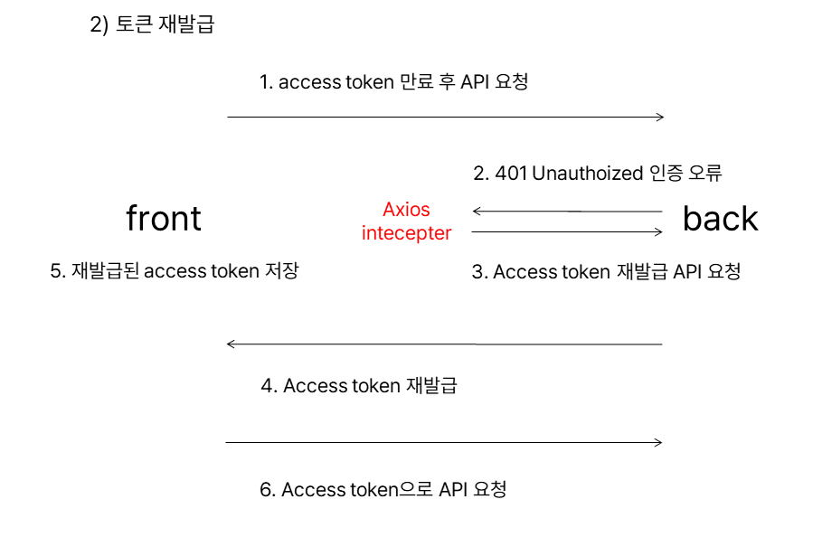

# HyperLocal-frontend

이웃의마켓 - 프런트엔드 개발

## 프로젝트 소개.

- 지역 내 공유 마켓 웹앱 이웃의 마켓입니다.
- [Live Demo](https://neighbors-market.netlify.app)에서 서비스를 확인해 볼 수 있습니다.
- 지역 내에서 이웃들과 배달비, OTT 등을 공동부담하거나 특정 물물을 공유할 수 있도록 게시글 작성, 실시간 채팅 등을 제공하는 커뮤니티입니다.
- 이 프로젝트는 마포구 청년 일자리 사업단의 지원으로 제작되었습니다.

---

---

개발기간 : 2022.08.01 ~ 10.13  
개발인원 : 3인

- 기획 : 최미성
- 디자인 / 스토리보드 : 최미성
- 프런트엔드 : 강대국
- 백엔드 : 김대희

---

## 개발환경 및 협업툴.

- React.js v18, styled-component v5
- REST API
- netlify
- figma
- slack, notion, jira, Github

---

## 주요 기능.

- kakao social login 
  
- axios instance 및 interceptor 이용 access token 재발급 
  
- 동네 검색 및 추가, 삭제
- 게시판 등록
  - 사진 파일 여러개 등록 가능, datepicker이용 custom calendar 구현
- 게시물 시간 순, 동네 별 정렬 가능
- 게시물 검색 기능
- 관심 게시판 표시 기능
- 마이페이지, 내정보, 로그아웃, 회원탈퇴

---

## 주요 이슈.

- airbnb eslint에 익숙치 않아 많은 부분을 예외처리
- spa router 설정 및 CD를 편하게 하기 위해 github-page에서 netlify로 배포환경을 변경
- 메인, 회원가입, 등록페이지 React.memo, useCallback을 이용 memoization 기법 적용
- backend rest API가 잘못되어서 다시 조율
- suspense, lazy이용해 router기준으로 code spliting했으나 UX를 헤쳐 비적용
- 중복된 component 모듈화하여 재사용
- axios instance, baseurl 설정을 통해 코드 중복 제거
- 컴포넌트 재활용을 위해 디자이너와 의견 조율

---

## 후기

### 배운점

- 게시판 CRUD를 경험해보았습니다. react로 CRUD를 하며 상태관리 및 비즈니스 로직 구현에 익숙해질 수 있었습니다.
- useState, useEffect, useCallback, useNavigate 등 react hook패턴에 대해 익숙해졌습니다.
- react에서 form을 다루는 법을 익히며 input내의 예외처리, 값 변경하는 법을 익혔습니다.
- jwt token을 통한 social login flow를 이해하고, access token 재발급 로직 구현을 위해 axios instance, interceptor를 사용하며 axios 옵션에 대해 경험할 수 있었습니다.
- local state와 비동기 서버 data 상태를 swr와 useState를 통해 분리했습니다.

### 협업

- REST API기반으로 backend와 소통을 위해 HTTP method 및 state code에 대한 지식을 쌓을 수 있었습니다.
- designer와 figma로 협업하고 design 및 user flow를 조율하고 개선하는 경험을 얻었습니다. 개발에 앞서 디자이너와 컴포넌트 및 폰트 등에 대한 협의가 충분히 필요함을 느꼈습니다. 지속적으로 바뀌는 디자인에 대한 이슈를 디자이너와 조율하는 경험을 얻을 수 있었습니다.
- jira software를 도입하여 이슈 및 일정관리를 하고, 1주 스프린트의 애자일 프로세스를 경험해보았습니다. 다른 팀원들이 어떤 일을 하는 지 파악할 수 있었고, 일정관리를 편하게 할 수 있었습니다. 1주 단위 스프린트와 피드백으로 업무 효율을 높일 수 있었습니다. 한편, 디자이너분의 경우 jira software template이 개발자 위주로 구성되어 있어 쓰기 힘들다는 의견을 제시했습니다.

### 부족한점

- prop drilling의 문제를 경험하고 전역상태관리 툴의 필요성을 느끼게 되었습니다.
- component folder 구조를 공통컴포넌트, 페이지, 기본 레이아웃으로 나누었으나 페이지가 많아 질수록 분명하게 나누기 쉽지 않았습니다. 디자인 스타일의 필요성을 느끼게 되었습니다.
- 비즈니스 로직이 더해지고 상태가 많아질수록 컴포넌트 안에 코드가 많아지고 리팩토링하기 힘들어졌습니다. MVVM패턴 및 디자인 패턴에 대해 공부하는 계기를 가졌습니다. 비즈니스로직과 상태관리를 분리하고 지속적으로 유지보수가 가능한 클린코드에 대해 공부하는 계기가 되었습니다.

---
